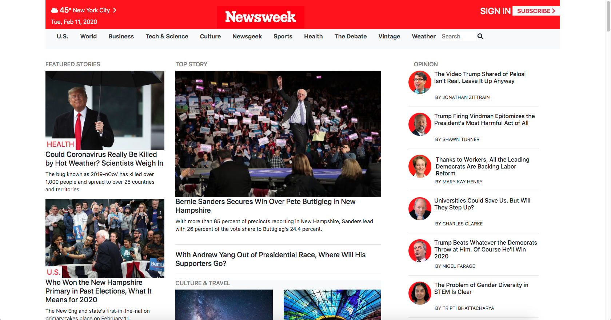

# the-news-week-clone

>newsweek.com clone.

Additional description about the project and its features.

## Built With

- HTML,
- CSS,
- Bootstrap

## Live Demo

[Live Demo Link](https://cocky-goldstine-738bb6.netlify.com/)

## Getting Started

To get a local copy up and running follow these simple example steps.

### clone the app

### open the index.html file in your browser

## Authors

👤 **Patrick Nyatindo**

- Github: [@githubhandle](https://github.com/nyatindopatrick)
- Twitter: [@twitterhandle](https://twitter.com/nyatindopatrick)
- Linkedin: [linkedin](https://linkedin.com/in/nyatindopatrick)

## 🤝 Contributing

Contributions, issues and feature requests are welcome!

Feel free to check the [issues page](https://github.com/nyatindopatrick/the-news-week-clone/issues).

## Show your support

Give a ⭐️ if you like this project!

## Acknowledgments

- Mictoverse TSC
- newsweek.com

## 📝 License

This project is [MIT](lic.url) licensed.
